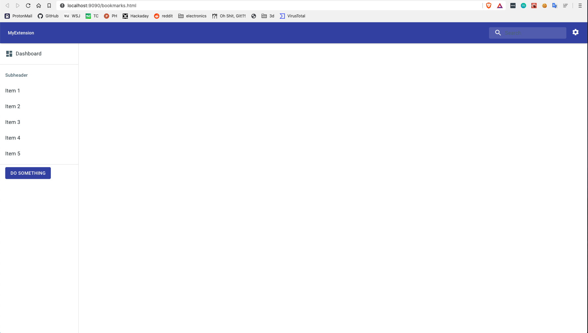
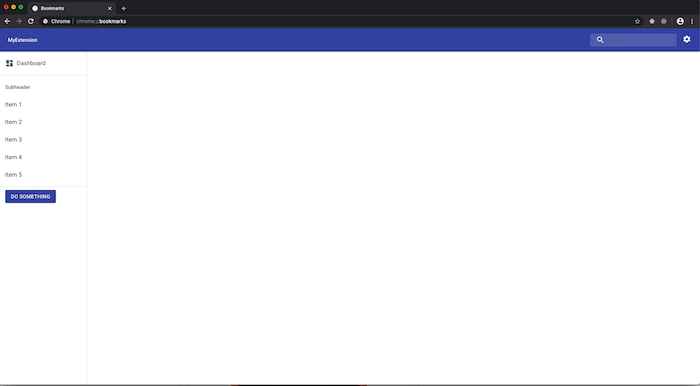

# react-material-ui-chrome-extension-template
React + Material-UI chrome url override extension template

## Getting started
1. git clone https://github.com/seanmiller802/react-chrome-extension-template.git
2. yarn install
3. add .env file in root with NODE_ENV=development and PORT=9090
4. yarn start:dev

should open a new tab at localhost:9090/bookmarks.html

## Out of the box
- chrome extension that overrides the default chrome bookmarks page at chrome://bookmarks
- dev server with Hot Module Replacement
- react application that use material-ui component library
- global application settings and themes via react context
- 3 themes

## Production
1. yarn build
2. chrome://extensions/
3. toggle Developer mode
4. choose load unpacked
5. select build folder
6. visit chrome://bookmarks

## Useful links
- https://developer.chrome.com/extensions
- https://webpack.js.org/
- https://material-ui.com/
