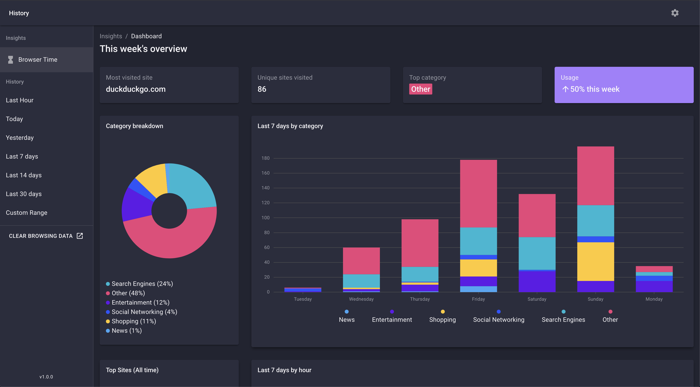

# BrowserTime
It's like screen time for your browser history

Available on the Chrome Web Store - https://chrome.google.com/webstore/detail/browsertime/gaafojlhhgdkcjiglocphepomogeagie/

Landing Page - http://browsertime.us/

## Description
The default history page in chrome is :shit:

BrowserTime is an open source chrome extension that aims to make it better.

 What you get

 - :mag_right: &nbsp; improved searching, filtering, and management of your history
 - :bar_chart: &nbsp; a sleak dashboard giving you a weekly breakdown of how you spent your time on the web
 - :art: &nbsp; 7 awesome UI themes

 

## Setup

### Run Development Server (currently buggy. suggested to just build for production)
Clone the repo:

```git clone https://github.com/seanmiller802/browsertime```

Install the dependencies

``` npm run install```

Add .env file in root directory

```NODE_ENV=development PORT=9090```

Start the development server

```npm run start:dev```

should open a new tab at localhost:9090/history.html

### Build for Production
Run the build script:
```npm run build``` 
Go to chrome://extensions/ or brave://extensions if using Brave
Toggle Developer mode
Click 'Load Unpacked' button
Select src/build folder
Visit chrome://history or brave://history
